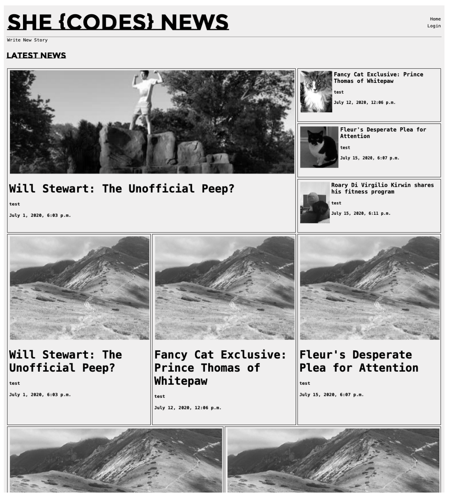
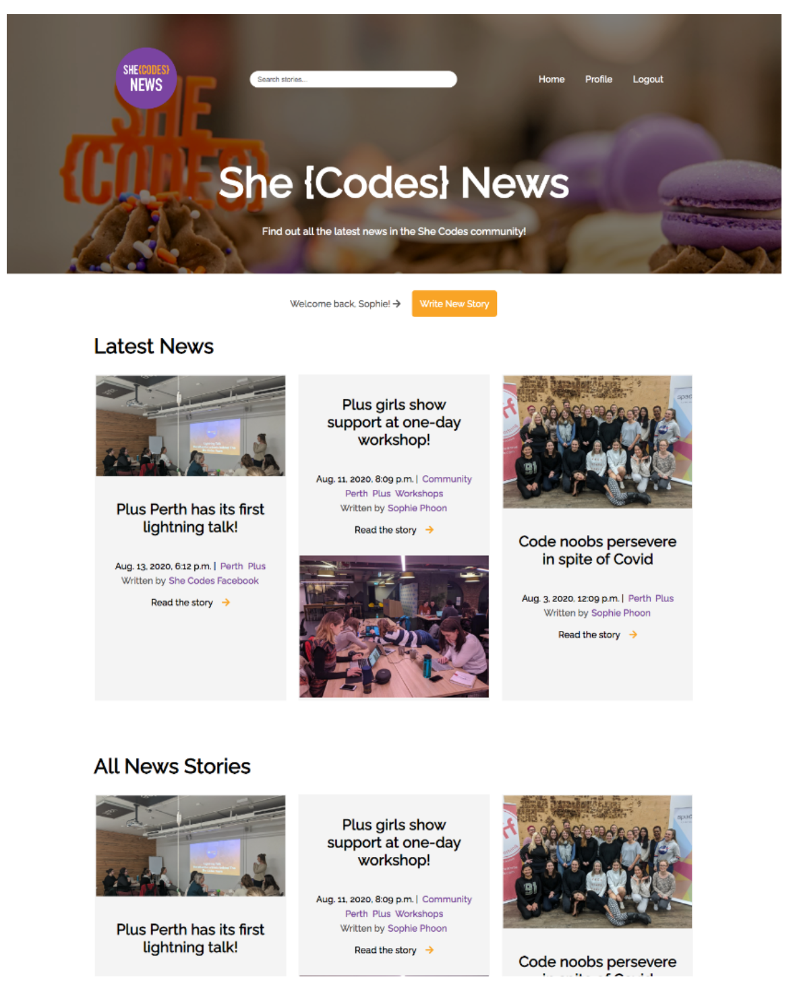

# Danielle's SHE{CODES} Django Project

### Project Description
> We are going to be creating websites for She Codes News! Hurrah! You are to create a news website that allows users to read news stories, and authors to create them.

### Project Requirements
**Setup**
> Starter files are provided for this project. In the first session working on this project, as a class, we will go through those starter files and get everyone’s project up and running. Part 1 and Part 2 also have setup steps that we will do as a class. We strongly recommend that you refrain from starting Part 1 or Part 2 until after we have completed the setup in class.

**Part 1**
> Facilitated Feature: Creating a form for adding new stories. Features to implement:
>  - Order the stories by date.
>  - Style the form for adding new stories.
>  - Add a field to the NewsStory model for an image url and use this image url rather than the default
>  - images provided in the starter.

**Part 2**
> Facilitated Feature: Creating a Users app. Features to implement:
>  - Functional login/logout buttons.
>  - Account view so authors can see their profile information. (Details!)
>  - Create Account functionality, so a new user can sign up to be an author.
>  - View stories by a particular author. Ask Qs about this 
>  - Show/Hide the relevant information and buttons based on whether the user is logged in/out (e.g. should only be able to see the button to create a new story if I am logged in).
>  - Enable/Disable the relevant features based on whether the user is logged in/out (e.g. should only be able to create a new story if I am logged in).
> Ask Qs about security 

**Additional Features**
>  - Add categories to the stories and allow the user to search for stories by category.
>  - Add the ability to update and delete stories.
>  - Add the ability to “favourite” stories and see a page with your favourite stories.

*Note*
> - You will use Django to create the website, and no other additional libraries are allowed unless approved by the Lead Mentor.
> - Make it your own! The code starter provided is to help you get the structure set up, and so you can look at something a little less ugly than the default ;) By the time you submit this, I would hope that you would have customised it to your taste and to what you think the She Codes News website should look like :) See the appendix for some inspiration.

### Submission
> Your code will be submitted via GitHub. Please include a directory in your repository containing a screenshot(s) of every page on your website.

**Appendix**
Original styling: 

Customised for inspiration:

